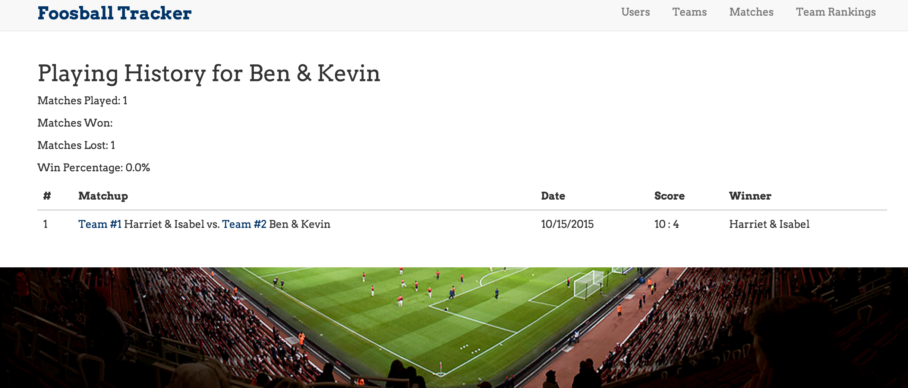
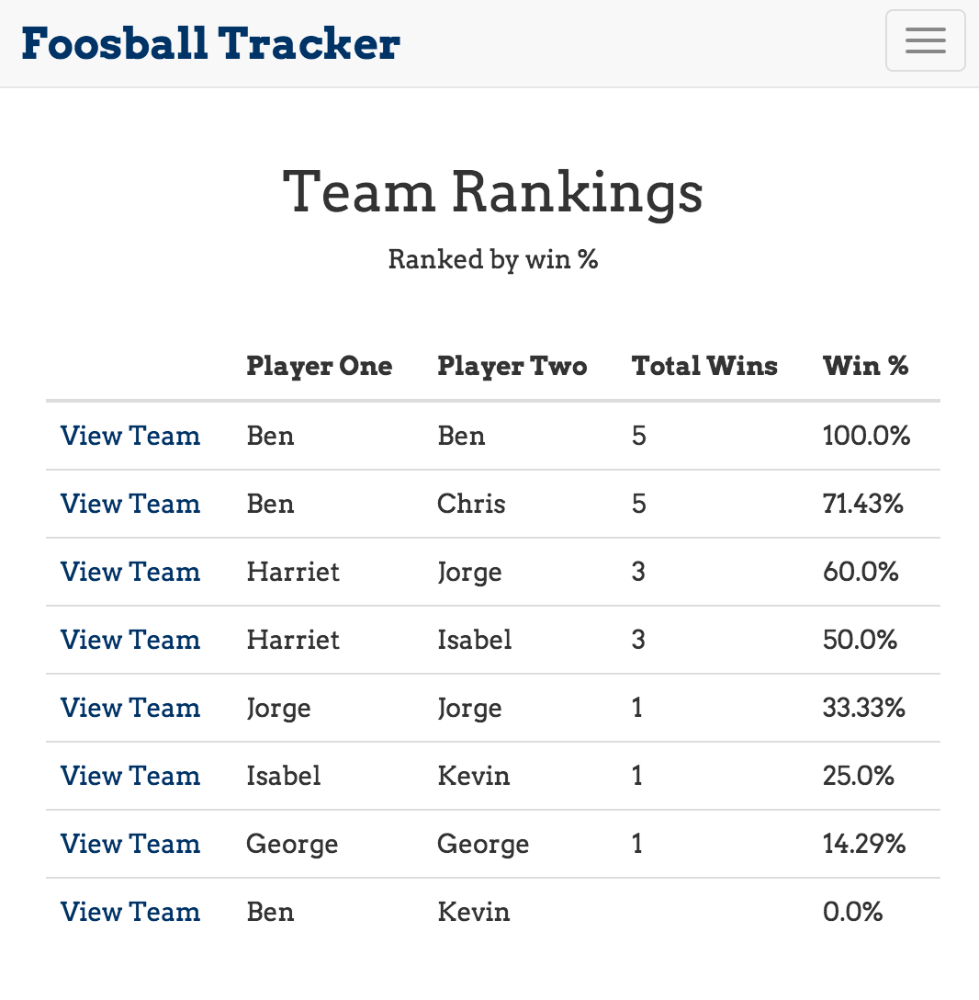

Foosball Tracker
===================
A Foosball Tracker to keep track of the games played, results and an overall leaderboard for a group of players. Built with Rails.

```
Key functionality includes the ability to:
- Create and manage users
- Create games (using 2 - 4 team members) Manage games (winner and score)
- Show the game history
- Show the basic stats of an individual player
```

Setup:
-------
```
git clone [url of repo]
bundle
bin/rake db:create
bin/rake db:migrate
bin/rake db:seed
bin/rails s

#to run tests
rspec
#to auto-run tests
guard
```

Sample User stories:
-------
```
As a foosball player
I want to record my games against my friends & colleagues
So that we have a permanent record of results

As a foosball player
I want to be able to create teams
So that I can keep track of who I played with

As a foosball player
I want to be able to see which partner I perform best with
So that I can play with them more!

As a foosball player
I want to view a ranking leaderboard
So that I see how much extra practice I need to reach the top.
```

Technologies Used:
-------
```
- [Ruby On Rails](http://rubyonrails.org/)
- Tested using [RSpec](http://rspec.info/)
- Capybara for Feature Testing
- [Shoulda](https://github.com/thoughtbot/shoulda) (Ruby gem for testing)
```

Improvements & known defects:
-------
- **Associations - specifing 2 FK's in Active Record:**
- I have utilised a HABTM relationship between Users & Teams and likewise between Teams & Matches. Whilst I feel this is a valid approach as I do not explicitly require a separate participations model with a :through relationship between Users and Teams, I intend to rewrite the application using utilising different associations in the near future. My focus here would be on more precisely defining the distinction between Player_1 and Player_2 in a team and Team_1 and Team_2 in a Match utilising an association such as below that will specify 2 FK's.

```
  - Class Team
  belongs_to :player_1, class_name: "Player", foreign_key: "player_1_id"
	belongs_to :player_2, class_name: "Player", foreign_key: "player_2_id"

  - Class Player
  has_many :players
```


- **Associations - duplication of info contained in join tables:**
- Whilst I feel the HABTM relationship between Users & Teams and likewise between Teams & Matches is sufficient. I have however not utilised the join tables appropriately. The addition of player_one and player_two attributes in the Team table is an error, as is the addition of team_one and team_two attributes in the matches tables.

- The user objects belonging to a team or the team objects belonging to a match are accessible via team.users and match.teams respectively. This has led to other issues within my code base and will be my primary change when working on this project again.


- **Validations:**
- I have a number of validations preventing the duplication of teams (i.e. a team cannot be created again if already created) although some of these are not fully tested. This is a key part of the application that needs to be improved.

- Most crucially using the Active Record "uniq" query method I was unable to then provide a flash[:alert] to user providing feedback as to why they cannot create a certain team. 


- **Partials:**
- Use partials for areas such as the flash[:notices] and flash[:alerts] in application.html.erb. Other areas that are ripe for the use of partials include some of the forms shared between edit and new views.


- **View Helpers:**
- Helper modules for the view helper methods which are currently cluttering the Models.


Extensions:
-------

- Add **Best of 3 style matches** with a Game model using the following associations:
  -  Game belongs to Team
  -  Team has_many Games

- Additional **individual user rankings seperated from team performance**. Given the above relationships linked correctly via join tables this information becomes easily accessible for manipulation.

Links:
-------

View site on Heroku (to follow)


Screenshots:
-------
Sample - Laptop Resolution




Sample - Mobile View


